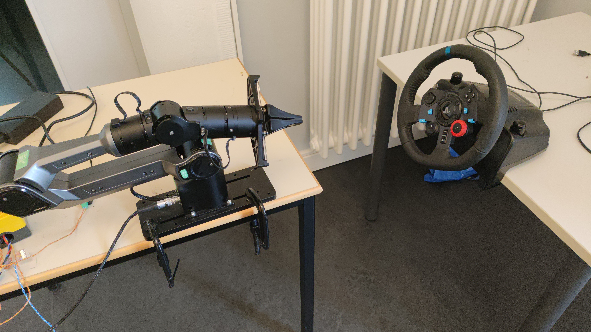

<div align="center">

# SteerBot 2
### A Digital Twin for Robotic Steering

*From simulation to real hardware — ROS 2 · Isaac Sim · CARLA · AgileX Piper · Logitech G29*



</div>

---

## 📋 Table of Contents

- [Overview](#-overview)
- [Key Capabilities](#-key-capabilities)
- [System Architecture](#-system-architecture)
- [ROS 2 Interfaces](#-ros-2-interfaces)
- [Grab & Rotate](#-grab--rotate)
- [Camera & ArUco Detection](#-camera--aruco-detection)
- [CARLA Integration](#-carla-integration)
- [AI Wheel-Hold](#-ai-wheel-hold)
- [The Isaac Sim Digital Twin](#-the-isaac-sim-digital-twin)
- [Build & Run](#-build--run)
- [Configuration & Parameters](#-configuration--parameters)
- [Troubleshooting](#-troubleshooting)
- [Known Limitations & Roadmap](#-known-limitations--roadmap)
- [Repository Layout](#-repository-layout)
- [Author](#-author)

---

## 🔍 Overview

A **digital twin** is a physics-accurate virtual copy of a real system, kept in sync with it
through the same software interface. Robotic-automotive research increasingly needs feedback
systems tested against real physical interaction — not just simulated numbers — but testing
that directly on a real vehicle is expensive and slow to iterate on.

**SteerBot 2** closes that gap. A 6-DOF **AgileX Piper** robot arm autonomously finds, grasps,
and turns a **Logitech G29** steering wheel — a safe, low-cost stand-in with genuine force
feedback that rotates like a real wheel. Every behavior is proven in **NVIDIA Isaac Sim** first,
then deployed unchanged to the real arm. **CARLA** closes the loop end-to-end: a simulated
driving command becomes real physical wheel motion, and the wheel's actual angle feeds back
into the simulator.

The goal: a robot that can take the wheel of a real car — automated, repeatable steering-actuation
testing, proven first in the digital twin.

---

## ✅ Key Capabilities

- 🤖 **Autonomous grab & rotate** — the arm finds the wheel, grasps the rim, and rotates it along
  a true circular arc, in 5 operating modes (`rotate`, `rotate_only`, `hold`, `ai_hold`, `servo_hold`)
- 📷 **Live camera-based wheel sensing** — an Intel RealSense D435 + ArUco marker replace
  hard-coded coordinates with a real-time 3D pose
- 🚗 **CARLA in the loop** — the physical G29 drives a virtual vehicle live, with force feedback
  pushed back through the real wheel
- 🧠 **Two independent AI wheel-hold methods** — a reinforcement-learning-tuned adaptive PID, and
  a direct PPO policy — both trained in Isaac Sim
- 🪞 **Sim ↔ real parity** — the same ROS 2 graph and the same motion-planning code run in Isaac
  Sim and on the physical arm; only the hardware layer changes

---

## 🧭 System Architecture

ROS 2 Humble is the backbone every subsystem talks over. A steering command from CARLA flows in
at the top; the camera and G29 sensing feed MoveIt 2 and the AI controllers, which drive the arm
over CAN (or drive Isaac Sim's physics in simulation); the wheel's resulting angle is sensed again,
closing the loop. This is the *same graph* whether SteerBot runs fully in simulation or on the
physical arm — only the hardware underneath changes.

```
            ┌──────────────────────────────────────┐
            │       CARLA Driving Simulator        │
            │     (Virtual Vehicle · Steering)     │
            └───────────────────┬──────────────────┘
                                │ /carla/vehicle/steer
                                │
┌────────────────────────────────┴─────────────────────────────┐
│                  STEERBOT 2 — ROS 2 HUMBLE                   │
│                                                              │
│    ┌──────────────┐  ┌─────────────┐  ┌─────────────────┐    │
│    │    Camera    │  │  G29 Wheel  │  │  AI Controller  │    │
│    │  D435+ArUco  │  │  + Force FB │  │    PID-RL·PPO   │    │
│    └──────────────┘  └─────────────┘  └─────────────────┘    │
│           │                 │                  │             │
│    ┌──────┬─────────────────┬──────────────────┬────────┐    │
│    │                      MoveIt 2                      │    │
│    │      Cartesian Arc Planning · Grasp & Rotate       │    │
│    └─────────────────────────┴──────────────────────────┘    │
│                              │                               │
│    ┌─────────────┐  ┌──────────────┐  ┌────────────────┐     │
│    │  Piper Ctrl │  │  Isaac Sim   │  │  G29 Force FB  │     │
│    │   CAN→Arm   │  │ Digital Twin │  │ Force Feedback │     │
│    └─────────────┘  └──────────────┘  └────────────────┘     │
│                                                              │
│    ┌────────────────────────────────────────────────────┐    │
│    │                WHEEL ANGLE FEEDBACK                │    │
│    │    closes the loop back to Camera / G29 sensing    │    │
│    └────────────────────────────────────────────────────┘    │
│                                                              │
└──────────────────────────────────────────────────────────────┘
```

- **Camera + G29 + CARLA** feed the system — wheel pose, live wheel angle, and a desired
  steering command from the driving simulator
- **MoveIt 2** plans the Cartesian grasp/rotate arc; the **AI Controller** (self-tuning PID or
  PPO) decides the next correction step to hold the wheel on target
- **Piper Controller**, **Isaac Sim**, and **G29 Force Feedback** act on that plan — over CAN on
  the real arm, or as physics simulation in Isaac Sim
- The loop **closes**: the wheel's resulting angle is sensed again on the next cycle — this is
  what makes it a digital twin and not open-loop playback

**Hardware**

| Component | Role |
|---|---|
| AgileX Piper | 6-DOF robotic arm that grasps and rotates the wheel |
| Logitech G29 | Force-feedback steering wheel — the physical steering interface |
| Intel RealSense D435 | Depth camera for live wheel detection |
| CAN bus | 1 Mbit/s real-time link driving the Piper arm |
| Test vehicle | VW bus, driven in CARLA and (loop-closure target) in real life |

**Software**

| Layer | Tool |
|---|---|
| Middleware | ROS 2 Humble |
| Motion planning | MoveIt 2 (`computeCartesianPath`, with segmented-planning fallback) |
| Simulation | NVIDIA Isaac Sim (digital twin) + Isaac Lab (RL training, 256 parallel envs) |
| Driving simulation | CARLA |
| Vision | OpenCV ArUco (`DICT_4X4_50`) |
| AI | PPO (stable-baselines3 / Isaac Lab rsl_rl) |

---

## 🧩 ROS 2 Interfaces

### Camera / ArUco (`g29_isaac_bridge`)

| Topic | Type | Direction | Notes |
|---|---|---|---|
| `/wheel/visible` | `std_msgs/Bool` | pub | true only while the marker is detected |
| `world → g29_joint_axis` | TF | pub | live wheel pose (real: camera + solvePnP; sim: visibility gate) |

### G29 Wheel Interface (`g29_isaac_bridge`)

| Topic | Type | Direction | Notes |
|---|---|---|---|
| `/wheel/steering_angle` | `std_msgs/Float32` | pub | physical wheel angle, degrees |
| `/wheel_states` | `sensor_msgs/JointState` | pub | joint `RevoluteJoint`, radians — feeds `hold` mode |
| `/g29/ff_force` | `std_msgs/Float32` | sub | drives the force-feedback daemon |
| `/joy` | `sensor_msgs/Joy` | sub | raw wheel/pedal input |

### Grab & Rotate (`piper_demo`, C++)

| Topic | Type | Direction | Notes |
|---|---|---|---|
| `/wheel_states` | `sensor_msgs/JointState` | sub | live wheel angle for `hold` mode |
| `/wheel/position_from_ee` | `std_msgs/Float32` | pub + sub | arm's own EE-derived wheel-angle estimate |
| `/ai/wheel_hold_action` | `std_msgs/Float32` | sub | AI-commanded step, degrees (clamped) — drives `ai_hold` |
| `/wheel/target_angle` | `std_msgs/Float32` | sub | target angle, radians — drives `rotate_only` / `servo_hold` |

### CARLA Bridge (`carla_steeringwheel_bridge`)

| Topic | Type | Direction | Notes |
|---|---|---|---|
| `/carla/vehicle/steer` | `std_msgs/Float32` | pub | vehicle steer command out to CARLA |
| `/carla/vehicle/throttle` / `/brake` | `std_msgs/Float32` | pub | pedal commands |
| `/carla/connected` | `std_msgs/Bool` | pub | bridge connection status |
| `/wheel/steering_angle` | `std_msgs/Float32` | sub | drives the CARLA vehicle from the physical wheel |
| `/wheel/target_angle` | `std_msgs/Float32` | pub | NCAP/avoidance target angle back toward the wheel |

> ⚠️ **Units note:** `/wheel/target_angle` is published in **radians** by the NCAP scenario runner
> and consumed in **radians** by the C++ grab/rotate node — this is the convention to use
> throughout. The standalone `carla_steering_publisher` node currently publishes this same topic
> in **degrees**; converting it to radians (`math.radians(...)`) is a one-line fix noted for a
> future revision.

---

## 🔄 Grab & Rotate

The core motion primitive: the arm models the wheel as a circle in 3D, approaches its rim,
grasps it, and rotates it along the true arc — rather than a naive joint-space motion.

1. **Wheel model** — a TF frame (`g29_joint_axis`) defines the wheel's center and orientation;
   radius and center are configurable (see [Configuration](#-configuration--parameters))
2. **Approach** — the end effector moves to an offset pose above the grasp point on the rim
3. **Grasp** — the gripper closes on the rim at the configured inset
4. **Rotate** — `computeCartesianPath` sweeps the end effector along the rim's circular arc,
   in `rotate_steps` segments, falling back to segmented planning if a full Cartesian path fails

**Five operating modes** (`mode:=` launch argument):

| Mode | Behavior |
|---|---|
| `rotate` | Full cycle: approach → grasp → rotate by `rotate_deg` → release |
| `rotate_only` | Rotates to a live target from `/wheel/target_angle`, no grasp |
| `hold` | Grasps and holds position, tracking live wheel feedback from `/wheel_states` |
| `ai_hold` | Grasps and holds; correction steps come from an AI controller on `/ai/wheel_hold_action` |
| `servo_hold` *(experimental)* | Tracks target angle via the `wrist_servo` joint instead of arm motion |

<div align="center">

**Isaac Sim, RViz, and the real arm — moving as one:**


</div>

---

## 📷 Camera & ArUco Detection

An Intel RealSense D435 plus an 8 cm ArUco marker (`DICT_4X4_50`, ID 0) locate the wheel in 3D,
replacing hard-coded coordinates with what the camera actually sees. CLAHE contrast correction
and `solvePnP` produce the marker pose, broadcast as a live TF frame the arm plans against.

The arm acts **only on what it can actually see** — if the marker is covered or out of view, it
refuses to move rather than acting on stale or guessed data.

<div align="center">

**Marker visible → grab & rotate runs:**


**Marker covered → arm refuses:**


</div>

---

## 🚗 CARLA Integration

The physical G29 steers a VW bus in CARLA live — turning the real wheel turns the virtual
vehicle, and force feedback pushes back through the real wheel, closing the loop on real hardware
rather than a simulated abstraction. Euro NCAP-style avoidance scenarios can drive a target
steering angle back toward the wheel/arm through the same interface.

<div align="center">

**Driving CARLA with the real G29:**


</div>

---

## 🧠 AI Wheel-Hold

Two independent methods hold the wheel steady on target once grasped — trained in **Isaac Lab**
(256 parallel environments) and deployed through the same `ai_hold` interface.

### Self-Tuning PID (reinforcement-learned gains)

A classical PID still performs the control — but a policy trained in Isaac Sim outputs fresh
`Kp`, `Ki`, `Kd` gains for it at every step, rather than using fixed hand-tuned values.

```
error = target − actual  →  trained policy sets (Kp, Ki, Kd)  →  PID computes correction  →  wheel holds
```

**Verified result** (60 s test, 3° step disturbance): settles in ~3 s, then holds to a
**mean error of 0.896°**, max 1.50°. In practice `Kp` sits near its maximum and `Ki` near its
minimum — `Kd` does most of the adaptive work.

### Reinforcement Learning (direct PPO)

No hand-written controller at all — a PPO agent learns the entire holding policy end-to-end by
trial and error, rewarded for staying on target with minimal effort.

**Verified result** (60 s deployment test, undisturbed target): **mean error 0.008°**,
max 0.015°.

### PID vs. PPO

| | Self-Tuning PID | PPO (direct) |
|---|---|---|
| Core idea | Learned policy tunes `Kp/Ki/Kd`; a real PID does the control | Policy outputs the correction directly |
| Transparency | Readable, classical control loop underneath | Black box |
| Tested against | 3° step disturbance | Undisturbed held target |
| Result | 0.896° mean / 1.50° max, ~3 s settle | 0.008° mean / 0.015° max |

The honest reading: PPO holds tighter on an undisturbed target; the PID has demonstrated it can
recover from a real disturbance and stay under a degree. Both satisfy the task.

<div align="center">

**Self-tuning PID holding in Isaac Sim:**


**PPO — training, then holding the wheel:**


</div>

---

## 🏗️ The Isaac Sim Digital Twin

The Isaac Sim scene (`steerbot_g29_piper_scene.usd`) hosts the G29 wheel, Piper arm, camera, and
ArUco marker as physics-accurate USD prims, driven by the same ROS 2 graph as the real hardware:

- **Force feedback** — an OmniGraph ROS 2 subscriber applies torque to the wheel's `RevoluteJoint`
  via PhysX `DriveAPI`, driven by `/g29/target_force`
- **Wheel angle publisher** — reads the wheel's live transform and publishes it to `/wheel/position`
- **`wheel_state_bridge`** — converts `/wheel/position` (degrees) into `/wheel_states` (radians),
  so `hold` mode gets live wheel feedback in simulation exactly as it does on the real G29
- **Disturbance injection scripts** — apply a one-shot or repeating nudge to the wheel to test
  hold-mode recovery

---

## ⚙️ Build & Run

Three independent ROS 2 workspaces, matched to where they run:

| Workspace | Runs on | Purpose |
|---|---|---|
| `ros2_ws/` | Sim PC (with Isaac Sim) | Isaac-Sim side: grab/rotate, camera, force drivers |
| `real_arm_ws/` | Lab PC + physical Piper/G29 | Real-hardware equivalents of the same nodes |
| `carla_ros_ws/` | Either, networked with a CARLA instance | CARLA ↔ G29 bridge |

### Build

```bash
cd <workspace>
colcon build --symlink-install
source install/setup.bash
```

### 1. Grab & Rotate — Simulation

```bash
ros2 launch piper_demo piper_grab_rotate.launch.py mode:=rotate use_sim_time:=true
```

Swap `mode:=` for any of the 5 modes (`rotate` | `rotate_only` | `hold` | `ai_hold` | `servo_hold`).

### 2. Grab & Rotate — Real Hardware

```bash
# Terminal 1: CAN bus
bash can_activate.sh

# Terminal 2: Piper driver
ros2 launch piper start_single_piper.launch.py

# Terminal 3: MoveIt
ros2 launch piper_with_gripper_moveit moveit_dt_gripper.launch.py

# Terminal 4: grab & rotate
ros2 launch piper_demo piper_grab_rotate.launch.py mode:=rotate use_sim_time:=false
```

Or use the bundled convenience launcher (spawns all terminals for you):

```bash
./start_dtp.sh -r     # real hardware
./start_dtp.sh -i     # Isaac Sim (use_sim_time)
./start_dtp.sh -f     # fake hardware (no sim, no real arm)
```

### 3. Camera & Wheel Sensing

| Function | Command |
|---|---|
| ArUco wheel detection (real, D435) | `ros2 run g29_isaac_bridge aruco_detector` |
| ArUco wheel visibility (sim) | `ros2 run g29_isaac_bridge aruco_detector` *(sim workspace)* |
| G29 steering angle + `/wheel_states` | `ros2 run g29_isaac_bridge g29_steering_node` |
| G29 force feedback | `ros2 run g29_isaac_bridge g29_ff` *(spawns the `ff_daemon` binary)* |
| Sim wheel-feedback bridge for `hold` mode | `ros2 run g29_isaac_bridge wheel_state_bridge` |

### 4. Other Piper Demo Nodes

| Function | Command |
|---|---|
| Basic arm demo motion | `ros2 launch piper_demo piper_demo.launch.py` |
| Pick & place demo | `ros2 launch piper_demo piper_pick_place.launch.py` |

### 5. Alternate G29 Control Nodes (sim workspace)

Earlier / alternate single-node control-loop experiments, independent of the Isaac-Lab-trained
AI wheel-hold pipeline below:

| Function | Command |
|---|---|
| G29 position controller | `ros2 run g29_isaac_bridge g29_position_controller` |
| G29 PID controller | `ros2 run g29_isaac_bridge g29_pid_controller` |
| G29 adaptive-gain PID controller | `ros2 run g29_isaac_bridge g29_ai_pid_controller` |

### 6. CARLA Integration

| Function | Command |
|---|---|
| Vehicle bridge only | `ros2 launch carla_steeringwheel_bridge carla_vehicle_only.launch.py carla_host:=<ip> carla_port:=2000` |
| Full bridge (vehicle + sensors + Piper) | `ros2 launch carla_steeringwheel_bridge carla_full_bridge.launch.py carla_host:=<ip>` |
| Drive the CARLA bus with the physical G29 | `ros2 launch carla_steeringwheel_bridge carla_g29_bus_drive.launch.py joy_device:=/dev/input/js0` |
| Euro NCAP avoidance scenarios | `ros2 launch carla_steeringwheel_bridge ncap_scenarios.launch.py scenario:=<name>` |
| Keyboard teleop (no G29 needed) | `ros2 run carla_steeringwheel_bridge keyboard_teleop` |

> `keyboard_teleop` publishes to the same topics as the G29 (`A`/`D` steer, `W`/`S` throttle/brake,
> `SPACE` handbrake, `R` reverse) so the CARLA bridge can be exercised without the physical wheel.

### 7. AI Wheel-Hold — Self-Tuning PID (flagship, RL-tuned gains)

```bash
# 1) train in Isaac Lab (headless)
python3 train_wheel_hold_pid.py

# 2) grasp the wheel in ai_hold mode
ros2 launch piper_demo piper_grab_rotate.launch.py mode:=ai_hold radius:=0.13 wheel_center_x:=0.60

# 3) in a second terminal, once the grasp confirms — run the trained agent
python3 ppo_wheel_pid_agent.py
```

> The inference script's checkpoint path is hardcoded at the top of the file
> (`CHECKPOINT = "..."`) — point it at your own trained model, or use the bundled
> `scripts/model_1499.pt` as-is.

### 8. AI Wheel-Hold — Direct PPO (Isaac Lab, 256-env)

```bash
python3 train_wheel_hold_v2.py             # train
# then, after grasping in ai_hold mode:
python3 ppo_wheel_inference_agent_v2.py    # run the trained policy
```

### 9. AI Wheel-Hold — Online PPO (stable-baselines3, trains live against Isaac)

```bash
python3 train_wheel_hold.py               # trains 1 env online, ±8° action range
python3 train_ppo_wheel.py                # SB3 variant
python3 train_ppo_wheel_big_action.py     # SB3 variant, ±5° action range
# then:
python3 ppo_wheel_inference_agent.py
```

### 10. Baseline / Utility Wheel-Hold Scripts

| Function | Command |
|---|---|
| Simple proportional hold agent (non-learned baseline) | `python3 ai_wheel_hold_agent.py` |
| Convenience launcher for `ai_hold` (sim/real coordinate presets) | `python3 piper_hold_wheel.py` |

### 11. Isaac Sim Scene Scripts — Active Pipeline

Run from **Isaac Sim → Window → Script Editor → Run Script**, against the current
`steerbot_g29_piper_scene.usd` scene:

| Script | Function |
|---|---|
| `g29_position_publisher.py` | Publishes the virtual wheel angle to `/wheel/position` |
| `g29_force_ros2_driver_scene5.py` | Applies `/g29/target_force` torque to the wheel joint (current scene) |
| `g29_ros_force.py` | Applies `/g29/target_force` torque (generic, ROS-topic driven) |
| `carla_bus_g29_sync.py` | Rotates the virtual wheel to match `/wheel/steering_angle` |
| `camera_publisher.py` | Publishes the Isaac camera feed for ArUco detection |
| `virtual_piper_g29.py` | Standalone sine-wave steering test rig (no physical G29 needed) |
| `wheel_disturb_once.py` | Injects a single angle disturbance — for testing `hold`/`ai_hold` recovery |
| `wheel_disturb_loop.py` | Injects repeating random disturbances |

### 12. Standalone Demo Scripts (no ROS required)

A separate, self-contained demo suite for the gripper, runnable directly with `python3`:

| Script | Function |
|---|---|
| `gripper_demos/detect_g29.py` | Scans connected HID devices for the G29 (troubleshooting) |
| `gripper_demos/gripper_interface.py` | Direct AgileX gripper control wrapper |
| `gripper_demos/run_gripper_terminal_demo.py` | ASCII-art animated grasp-cycle demo |
| `gripper_demos/run_gripper_steering_demo.py` | Matplotlib animation of the grasp cycle |
| `gripper_demos/vehicle_gripper_integration.py` | Simulated end-to-end integration demo |

---

## 🛠 Configuration & Parameters

### Grab & Rotate (`piper_grab_rotate.launch.py`)

| Parameter | Default | Meaning |
|---|---|---|
| `mode` | `rotate` | `rotate` \| `rotate_only` \| `hold` \| `ai_hold` \| `servo_hold` |
| `wheel_center_x/y/z` | `0.60 / 0.0 / 0.85729` | wheel pivot in the planning frame (m) |
| `radius` | `0.13` | grasp radius on the rim (m) |
| `rotate_deg` | `-55.0` | rotation sweep for `rotate` mode |
| `rotate_steps` | `24` | Cartesian-path segments for the rotation arc |
| `start_angle_deg` | `90.0` | starting grasp angle on the rim |
| `approach_offset` | `0.10` | pre-grasp standoff distance (m) |
| `rim_inset` | `0.015` | how far inside the rim edge the gripper closes (m) |
| `eef_step` / `min_fraction` | `0.01` / `0.10` | Cartesian planning resolution / minimum accepted path fraction |
| `speed_fast` / `speed_slow` | `0.2` / `0.1` | velocity scaling for approach vs. rotate |
| `servo_joint` / `servo_scale` | `wrist_servo` / `1.0` | `servo_hold` target joint and action scale |
| `use_sim_time` | `true` | `false` for real hardware |

### `wheel_state_bridge` (sim only)

| Parameter | Default | Meaning |
|---|---|---|
| `sign` | `-1.0` | sign applied to the converted angle — flip to `1.0` if the correction direction is reversed |
| `joint_name` | `RevoluteJoint` | joint name published in `/wheel_states` |

### AI Wheel-Hold gain ranges (self-tuning PID policy action space)

| Gain | Range |
|---|---|
| `Kp` | 0.1 – 2.0 |
| `Ki` | 0.001 – 0.05 |
| `Kd` | 0.01 – 0.5 |

---

## 🔧 Troubleshooting

- **CAN bus not found / arm not responding** — re-run `can_activate.sh`; use `find_all_can_port.sh`
  to identify the correct USB-to-CAN interface if multiple adapters are connected.
- **"Gripper is not part of a kinematic chain" warning** — harmless; MoveIt logs this for the
  gripper group but planning is unaffected.
- **Arm refuses to move (camera mode)** — check `/wheel/visible`; the marker must be unobstructed
  and within the camera's field of view.
- **`hold` mode not correcting, or correcting backward (sim)** — confirm `wheel_state_bridge` is
  running; if the arm corrects the wrong direction, relaunch it with `sign:=1.0`.
- **`servo_hold` errors immediately** — expected; see [Known Limitations](#-known-limitations--roadmap).
- **Force feedback silent** — check the `ff_daemon` process started alongside `g29_ff`; confirm
  `/g29/ff_force` is being published.

---

## 🧱 Known Limitations & Roadmap

- **`servo_hold` is experimental** — the `wrist_servo` joint is defined in the URDF but is not yet
  wired into the SRDF arm group or the joint-trajectory controllers, so this mode does not yet
  drive the arm.
- **CARLA → arm coordinate transform** is not yet complete — closing this fully connects a CARLA
  scenario's steering command to physical arm motion end-to-end.
- The **NCAP avoidance scenarios** are not yet run through the full physical loop.
- Adding a **7th degree of freedom** would increase the arm's reachable range on the wheel.

**Ahead:**
- Deploy both AI wheel-hold controllers to the real arm and physical G29
- Complete the CARLA → arm coordinate transform
- Run Euro NCAP test scenarios through the full physical loop
- Finish wiring the 7-DOF `wrist_servo` joint

---

## 📂 Repository Layout

```
SteerBot-DigitalTwin/
├── Steeringwheel-Workspace/
│   ├── ros2_ws/            # sim-side ROS 2 workspace (Isaac Sim PC)
│   │   └── src/
│   │       ├── piper_demo/         # grab & rotate motion node (C++/MoveIt 2)
│   │       ├── g29_isaac_bridge/   # camera, G29, AI bridges
│   │       └── piper_ros/          # AgileX Piper vendor SDK (driver, URDF, MoveIt config)
│   └── isaac/scenes/       # Isaac Sim USD scene + OmniGraph scripts
│   └── start_dtp.sh        # convenience launcher (real / sim / fake modes)
├── real_arm_ws/            # real-hardware ROS 2 workspace (lab PC)
├── carla_ros_ws/           # CARLA ↔ G29 bridge workspace
├── gripper_demos/          # standalone gripper demo suite (no ROS required)
└── images/, media/         # README assets
```

---

## 👤 Author

**Mohammed Aldabagh**

Ostfalia University of Applied Sciences
